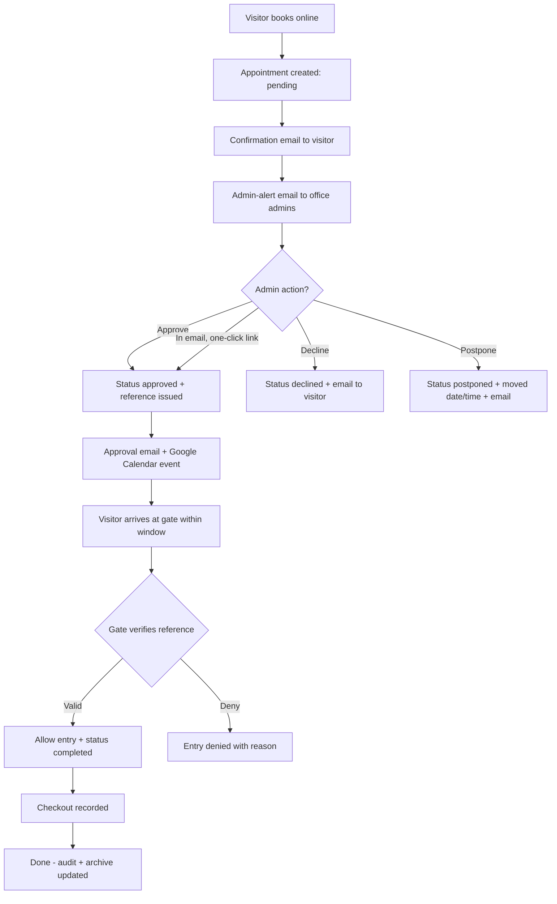
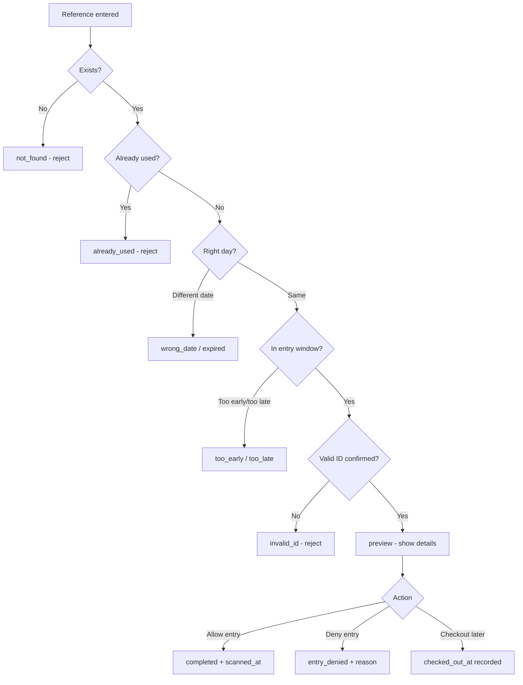
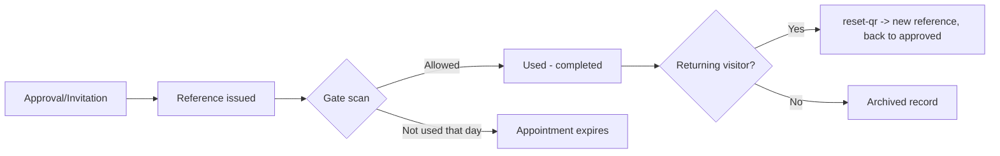
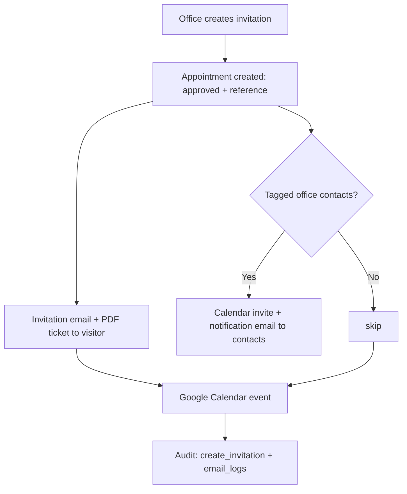
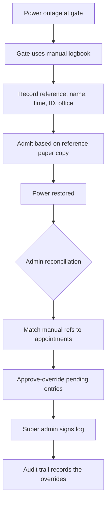

# USLS OASYS — Technical Specifications

This document describes the system in detail: every feature, the actors/roles, the data model, the business rules, integrations, and process flow charts.

---

## 1. System overview

USLS OASYS (Online Appointment System) is a web application that lets visitors to the University of St. La Salle book campus appointments, lets office admins review and approve (or decline/postpone) those bookings, and lets gate security verify entries using single-use reference numbers.

Key properties:
- **Push-based notifications:** visitors and admins are kept informed by email at every stage of the appointment lifecycle.
- **Reference-based gate access:** approvals produce a unique reference number; the gate verifies it once and records entry/checkout.
- **Three actor roles:** super admin, office admin, gate user.
- **Integrations:** Supabase (DB + Auth), SMTP email, Google Calendar, cPanel MySQL archive.

---

## 2. Actors and roles

| Role | What they can do |
|---|---|
| **Visitor (public)** | Book an appointment, receive emails, present reference at the gate. No login required. |
| **Office admin** | Review appointments of their office: approve, decline, postpone; block time slots; create manual invitations; manage office contacts; see their office's data only. |
| **Super admin** | Everything an office admin can do **for any office**, plus: manage offices, manage admin accounts, view the full audit log, edit system settings, approve-override during backup reconciliation. |
| **Gate user** | Sign in at the gate station with employee ID + password, verify reference numbers, allow/deny entry, record checkout, see today's expected visitors. |

Access enforcement is application-level (the `admins` table), verified on every API request (`src/lib/rbac.ts`).

---

## 3. Feature specification

### 3.1 Public appointment booking

**Inputs:** name, phone, email, visitor category (`external | parents | alumni | vendor`), valid ID type, office, person to meet, date, time slot, duration (30/60 min), purpose of visit, optional group visitors (up to 10 total) and optional vehicles (up to 5).

**Business rules:**
- Office must exist and be active.
- Date must be valid, not in the past, not a weekend, and within `max_advance_days`.
- Time slot must be within operating hours; lunch break (12:00–1:30 PM) is never bookable.
- Diminished availability: slot must not be blocked (admin) and must have remaining capacity, accounting for 60-minute appointments occupying two slots.
- Fields are length/format validated; valid ID must be on the whitelist.
- Rate-limited to 5 bookings / 15 min / IP.

**Result:** an appointment in `pending` status is created, the visitor gets a booking confirmation email, office admins get an admin-alert email with one-click Approve/Deny links.

### 3.2 Approval workflow (pending → approved)

- The office admin (or a super admin) approves a pending/postponed appointment.
- Approval generates a **unique reference number** and sets the appointment to `approved` (atomically guarded against double-review).
- The visitor receives an approval email with the reference number.
- A **Google Calendar event** is created for the visitor and the office email.
- The event is mirrored to the cPanel archive and logged in the audit trail.

However, note: the action-token links let an admin **approve/decline directly from email** without logging in (valid 72 hours, HMAC-signed).

### 3.3 Decline / postpone

- Decline sets status to `declined` with an optional reason; the visitor gets a decline email with a rebooking link.
- Postpone keeps the appointment alive (`postponed` status) and moves it to a new date/time; the visitor gets a postponement email showing old vs new schedule. Postponed appointments can later be approved or declined again.

### 3.4 Reference numbers and the gate

- Reference numbers: 8 characters from a Crockford-style alphabet (`23456789ABCDEFGHJKLMNPQRSTUVWXYZ`), collision-checked at generation.
- They are single-use. A used reference cannot be reused (`qr_used_at` prevents duplicate scans).
- Entry window: 30 minutes before to 15 minutes after the scheduled time.
- The gate can also re-issue a reference (`reset-qr`) for a completed appointment so a returning visitor gets a fresh code.

### 3.5 Gate entry flow (security)

1. Gate user signs in with employee ID + password (`/entry`).
2. They either type/paste a reference or click a visitor in today's expected list (auto-fills).
3. `Verify Reference Number` runs a preview: the system shows the appointment details and whether it's valid to enter.
4. `Allow Entry` records entry (status → `completed`, timestamp). `Deny Entry` requires a reason and records the denial.
5. After the visit, `Record Visitor Checkout` timestamps departure.
6. Invalid/expired/early/late/already-used/mismatched-ID cases are rejected with clear reasons.

### 3.6 Manual invitations

Offices can issue pre-approved gate passes without the normal approval queue:
- Appointment is created already `approved` with its reference number.
- The visitor receives an invitation email with a **PDF ticket** attachment.
- Tagged **office contacts** get a calendar invite + a plain notification email (no ticket PDF).
- A Google Calendar event is created for the visitor, tagged contacts, and office.

### 3.7 Office contacts

- Each office can maintain a list of contacts (name, email, position).
- Contacts are tagged on invitations and are snapshotted into `appointment_contacts` at invite time (so later edits don't corrupt past invites).
- When power is restored after an outage, contacts/offices can still be maintained normally; the backup reconciliation is handled in `Backup_Procedures.md`.

### 3.8 Block time management

Admins can block/unblock specific date+time slots for their office (with an optional reason). Blocked slots are unavailable in the booking availability feed.

### 3.9 Offices management (super admin)

CRUD for offices: name, category, email, contact email/phone, operating hours, capacity per slot, active flag. Deactivation (soft delete) hides the office from booking without deleting history.

### 3.10 Accounts management (super admin)

Create/remove admin accounts for any role. Gate users are created with an employee ID + password and use synthetic auth emails (`gate.<id>@auth.usls-oas.local`). Removal requires re-authentication and can't delete your own account.

### 3.11 Audit log (super admin)

Every meaningful action is recorded: logins, account/office/contact changes, blocks, approvals, declines, postponements, reference resets, gate entries, denials, checkouts, invitations. The Audit Log page renders labels, targets, and one-line summaries (limited to the latest 100 entries).

### 3.12 System settings (super admin)

- System name, support email, support phone.
- Booking rules: max advance days, minimum notice hours.
- Email notification toggles: confirmation, admin alert, approval, decline, postponement, invitation, reference re-send.

### 3.13 Backup / power-outage manual mode

During a power outage the gate cannot scan electronically. It falls back to the manual gate log (reference numbers written down), and admins perform approve-overrides / reconciliation once power returns. Full procedure in `Backup_Procedures.md`.

---

## 4. Data model

Main tables (Supabase/Postgres):

| Table | Purpose |
|---|---|
| `offices` | Campus offices (name, category, email, contact info, hours, capacity, active). |
| `appointments` | Appointments/invitations (status, date/time, duration, visitor info, reference, timestamps). |
| `admins` | Admin accounts + role + office assignment + employee_id for gate users. |
| `audit_logs` | Immutable-ish audit trail (actor, action, targets, JSON details). |
| `email_logs` | Outgoing email attempts per type/status. |
| `blocked_times` | Admin-blocked date+time slots. |
| `system_settings` | Key/value configuration store. |
| `app_health` | Heartbeat rows from the cron keep-alive. |
| `appointment_visitors` | Group visitors per appointment (1–10). |
| `appointment_vehicles` | Vehicles per appointment (0–5). |
| `office_contacts` | Per-office contact list (name, email, position, active). |
| `appointment_contacts` | Tagged contacts snapshot per appointment. |

Appointment statuses: `pending | approved | postponed | declined | entry_denied | completed | expired`.

The cPanel MySQL mirror holds a denormalized `appointments` table plus `appointment_visitors` / `appointment_vehicles` for the legacy archive (manual SQL execution; not part of the Supabase migrations).

---

## 5. Integrations

| Integration | Direction | Purpose |
|---|---|---|
| Supabase Postgres | App → DB | Primary data store. |
| Supabase Auth | App ↔ Auth | Login sessions for admins/gate users/gate kiosk. |
| SMTP (Nodemailer) | App → Email | All transactional emails. |
| Google Calendar (service account) | App → Calendar | Creates events on approval/invitation. |
| cPanel MySQL | App → MySQL | Appends appointment archive copy (best-effort, non-blocking). |

External services are non-blocking by design: email/calendar/archive failures do not fail the HTTP request (they run after the response or are caught/logged).

---

## 6. Reliability and safety features

- **Atomic status transitions:** approve/decline/postpone/reset/scan use guarded updates (e.g. `.eq("status", ...)`) so two reviewers can't both succeed.
- **Reference uniqueness:** generation checks the DB (up to 5 tries) before accepting a reference.
- **Expiry on missed entry:** if a visitor arrives more than 15 minutes late, the appointment is marked `expired`.
- **Secret handling:** error sanitization strips secrets from logs; `QR_SECRET` is enforced (no dev default accepted).
- **Rate limits:** booking, gate scanning, gate login, admin auth.
- **Security headers:** HSTS, CSP, iframe denial, no-store on APIs (edge middleware).
- **Audit trail:** critical actions are always traceable.

---

## 7. Process flow charts

### 7.1 Booking → Gate-entry end-to-end

### 7.2 Gate verification decision tree

### 7.3 Reference lifecycle

### 7.4 Invitation flow (office-issued passes)

### 7.5 Power-outage (manual backup) flow

---

## 8. Security posture summary

- Only `super_admin` can modify offices, accounts, settings, or read the full audit log.
- `office_admin` is always scoped to their own office (server-enforced on every API call).
- `gate_user` can only reach the gate endpoints.
- Public endpoints are read-only (offices, availability) or rate-limited writes (booking).
- Sensitive values never reach client components; the server uses a service-role client for writes.